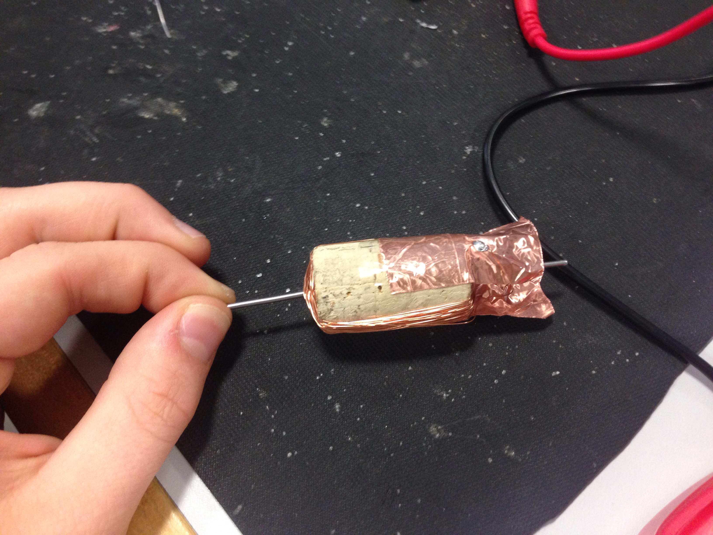
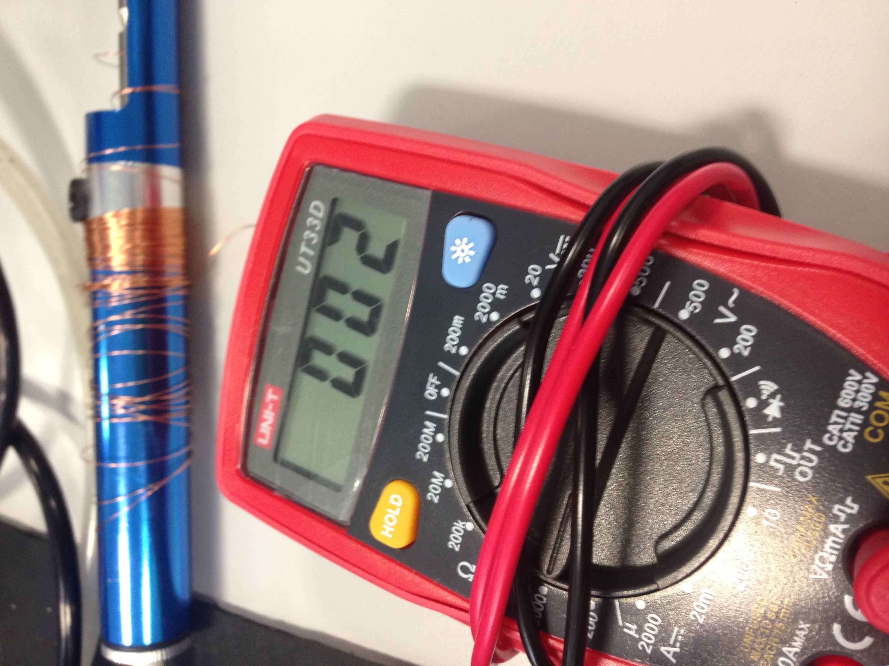

# Journal

Markdown is a method of writing information, and using syntax to format that information. This information can be converted directly into HTML.

## Table of contents

[Markdown Syntax](https://github.com/Csaba1988/roco222/blob/master/Markdown-Syntax.md)

[Basic Terminal commands](https://github.com/Csaba1988/roco222/blob/master/Basic-Terminal-commands.md)

[Git repositories](https://github.com/Csaba1988/roco222/blob/master/Git-repositories.md)

[Building a dc motor](https://github.com/Csaba1988/roco222/blob/master/Building-a-dc-motor.md)

[ROS - Robot Operating System](https://github.com/Csaba1988/roco222/blob/master/ROS-Robot-Operating-System.md)

--- 
## Markdown Syntax
+ using "#" will create headers. Increasing the number of "#'s" will reduce the size of the header.
+ typing ** ** or __ __ will create **bold** text.
+ typing _ _ or * * will create _italicised_ text.
+ through typing "-", "+" or "*" a bullet list can be created.
+ two spaces at the end of a line will create a one line break.
+ typing "---" will create a horizontal line, useful for separating information.
+ typing "1. 2. 3. etc " will create a numbered list.
+ typing "[link]""(the actual link)" (*without the "'s*).

---

## Basic Terminal commands
The following bullets are commands that can be entered into a terminal to achieve a certain result and an overview of what those results are.
+ "$ ls" will list the directory contents.
+ "$ cd /tmp" will move to a temporary directory (using the RAM) this will be deleted after this session, however using the RAM will mean it is a lot faster.
+ the command "cd" will change directory.
+ using the "$" sign will mean you dont have to type the entire route of the directory you are trying to reach when using the "cd" command. e.g. "cd $HOME" is the same as cd "/students/home".
+ "mkdir" will make a directory.
+ "echo "*thing*"" will write thing. " echo "Hello" > hello.md" will make a document and write "hello" in that document.
+ "cat hello.md" will write out the contents of the document "hello".
+ cp hello.md hello-again.md will create a "hello-again doc" and copy the contents of "hello" into "hello-again".
+ "mv hello-again.md hello-hello.md" will rename "hello-again" to "hello-hello".
+ "rm hello.md" will remove the doc "hello".
+ "> hi.md" will create a doc called "hi".
+ "rm -rf" will remove files without question or inhibition repeatedly.
+ "cat /proc/cpuinfo" will display the info of the cpu.

---

## Git repositories

Git repositories are for saving and sharing notes by making backup copies on the internet.  

* __git init__
  * Creates a _git_ repository by creating a hidden _.git_ folder which stores all the objects _git_ manipulates.  
* __git clone /path to repository__
    * Creates a working copy of my repositroy.  
* __git clone username@host:/path to repository__
    * For using a remote server if I created a clone.
* __git config user.name "Firstname Surname"__
    * Defines _user name_
* __git config user.email "email"__
    * Defines _user email_
* **git add** _file name_
    * Introduces the file _file name_ to _git_
* __git commit__ *file name*
    * Record changes to the repository/file if file name included
    * Allows us to create a message briefly explaineing about the     changes or the file.  
    * __-m__ lets us type the commit message straightaway.  
* __git log__/
* __git log__--author=_bob_
    * Displays commits that _bob_ made.
* __git log --pretty=oneline__
    * Displays everything in a compressed way by onelining each commits.
* __git log --graph --oneline --decorate --all__
    * Creates an ASCII art tree of all the branches, decorated with the names of tags and branches.  
* __git log --name-status__
    * See only which files have changed.  
* __git log --help__
    * Displays possible git log command versions.
* __git tag 1.0.0__ _commit references first 10 character_
    * It is recommended to create tags for software releases. 
* __>README.md__
    * It is customary to create a README file that describes using markdown syntax the content of the repository.  
* __git status__
    * This command checks if any file need to be added or if there is a change that needs to be commited.  
* **git checkout** _branchname_
    * Moves to the specified branch.  
    * __-b__ before _branchname_ creates the specified branch.  
    * __-d__ _branchname_ deletes the specified branch.  
    * We don`t have to share every branch so we can have one to work on locally and then only share it when it is ready.
* __git push origin__ _branch_
    * Shares the specified branch with the online repository.  
* __git merge__ _branch_ 
    * Merges the specified branch with the active branch.  
* __git diff__ *source_branch* *target_branch*
    * Allows us to have a preview before merging.  
* __git pull__
    * Imports fetches changes made in remote repository
* __git remote add origin https://github.com/<account>/<repo>.git__
    * Adds my repository in my GitHub account to my local repository.
* __git push -u origin__
    * Adds my files to the GitHub repo I have created.
	* In my case this is what I have done:
	* csaba@csaba-CR61-2M-CX61-2OC-CX61-2OD:~/Documents/roco222$ 		  git push -u origin
	  Username for 'https://github.com': Csaba1988
	  Password for 'https://Csaba1988@github.com': 
	  No refs in common and none specified; doing nothing.
	  Perhaps you should specify a branch such as 'master'.
	  Everything up-to-date

	  csaba@csaba-CR61-2M-CX61-2OC-CX61-2OD:~/Documents/roco222$ 	   	  git help config  

	  csaba@csaba-CR61-2M-CX61-2OC-CX61-2OD:~/Documents/roco222$ 		  __git config --global push.default simple__  

	  csaba@csaba-CR61-2M-CX61-2OC-CX61-2OD:~/Documents/roco222$ 	 	  git push -u origin  

	  fatal: The current branch master has no upstream branch.
	  To push the current branch and set the remote as upstream, 		  use  

    	       git push --set-upstream origin master  

	  csaba@csaba-CR61-2M-CX61-2OC-CX61-2OD:~/Documents/roco222$ 	       __git push --set-upstream origin master__
	  Username for 'https://github.com': Csaba1988
	  Password for 'https://Csaba1988@github.com': 
	  Counting objects: 12, done.
	  Delta compression using up to 8 threads.
	  Compressing objects: 100% (10/10), done.
	  Writing objects: 100% (12/12), 2.43 KiB | 0 bytes/s, done.
	  Total 12 (delta 2), reused 0 (delta 0)
	  remote: Resolving deltas: 100% (2/2), done.
	  To https://github.com/Csaba1988/roco222.git
	   * [new branch]      master -> master
	  Branch master set up to track remote branch master from 	    origin.  

* __ls -al ~/.ssh__
    * Lists the files in your .ssh directory, if they exist  
* __ssh-keygen -t rsa -b 4096 -C "your_email@example.com"__
    * Generates a private and a public key that can be used to acces my online repository without typing in my Account name and password every time. In the process I have the option to choose where do I want to save my keys. I also have to create a passphrase for additional security that acts like a password.
* __eval "$(ssh-agent -s)"__
    * Starts the ssh agent in the background. I can use this agent to handle my keys.
* __ssh-add ~/.ssh/id_rsa__
    * Adds the private key to the agent.
* __Adding key to the GitHub account__
    * We can either use xclip (_sudo apt-get install xclip_) that copies the public key to the clipboard (*xclip -sel clip < ~/.ssh/id_rsa.pub*) or just simly navigate to the .ssh folder in Files and copy the public key from their to GitHub/Settings/SSH and GPG keys/new key. I can name my key at the Title section.

---

# Building a dc motor

* __Step 1 – Build a commutator__
    * You have been supplied with a cork and adhesive copper tape.
    * Attach the tape so it can be used to form a commentator
    * You may need sell tape to increase the strength of the design

* __Step 2 – Add support shaft__
    * You have been supplied with two pins.
    * Press then into opposite sides of the cork to provide a main shaft for the armature
    * Be careful not to damage the commutator!

* __Step 3 – Wind the armature coil__
    * You have been supplied with about 10m of enamelled copper wire
    * Wind the wire around the cork.
    * Use sellotape to fix it down. Record how many turns you use. It should be at least 60 turns and preferably
more: Have used 60 turns
    * 

    * Make sure both ends of the wire will remain accessible.
    * Use sandpaper to remove the enamel at the ends: Used a soldering iron as well and checked it by spreading solder at the ends. If the enamel has gone then the solder spreads really well.
    * Solder the end of the coil wires onto the copper commutator sections
    * Measure the resistance of the coil: 2 Ohms
    * 

* __Improved Motor__
    * We used 2 windings 60 turns each
    * Made the commutator smoother the gaps in between smaller and added additional support so it stays in shape.

* __Improved Motor2__

![Improved DC Motor] (/roco222/DC_motor_images/ImprovedDCMotor.JPG)

    * We have designed the armature and the mounts in SolidWorks and made it so we can use 4 windings 100 turns each. We have used a screw for a shaft and the ball bearings from fidget spinners. Initially we used different ballbearings but we found that we did not pay attention to the abec number so the ballbearings that we used were to stiff.  
    * For the commutator we have used foam pad on a nut and cut up a copper compression olive in 8 bits and stick it on the foam.

![Brushes and commutator] (/roco222/DC_motor_images/Brushes.JPG)

    * We made the mount of the magnets from wood.
    * For the encoder part I have made the disc out from cardboard and drilled a hole through the mount and placed the the led in the hole.

![Encoder] (/roco222/DC_motor_images/Encoder.JPG)

* __Motor characteristics__
    * Governing equations:
    * B (inside a solenoid) = µ0i(N/l)
    * Phi = BAcosø
    * T = phiIcZp/PI

---

# ROS - Robot Operating System

* __roscore__

    * Starts ros. I had to install it first with the command __sudo apt install python-roscore__

* __rostopic list__

    * Lists all the available rostopics. Also had to install first wc __sudo apt install python rostopic__
    * It has listed two
        * __/rosout__ ROS client libraries are required to publish console logging messages to the /rosout topic as a standard interface. 
        * __/rosout_agg__ is an aggregated feed for subscribing to console logging messages. This aggregated topic is offered as a performance improvement: instead of connecting to individual ROS nodes to receive their console messages, the aggregated message feed can instead be received directly from the rosout node. 

* __Installation__

    * All the above installations are installing the linux version of ROS. Linux has its own set of packages and they are from them. To install more packeges I have to follow a set of instructions to install the whole thing with the packeges that ros updates.

* __Arduiono as a node__

    * __sudo apt install ros-kinetic-rosserial-python ros-kinetic-rosserial-arduino__ will install rosserial on my computer that allows communication between ros and the arduino IDE
    * __rosrun rosserial_arduino make_libraries.py <sketchbook location>__ will set up ros.lib and the IDE will be able to recognise examples as well as communicate with ros.

* __std_msgs__ it has different type of variables defined in them that we can use fe.: UInt16 or string etc.

* __rostopic pub <topic name> <topic type> [data]__ allows us to publish to a topic a certain type of data.

* __rosparam__ rosparam is a command-line tool for getting, setting, and deleting parameters from the ROS Parameter Server

    * Commands:
	rosparam set	set parameter
	rosparam get	get parameter
	rosparam load	load parameters from file
	rosparam dump	dump parameters to file
	rosparam delete	delete parameter
	rosparam list	list parameter names
    * set robot_description -t models/robot-arm.urdf
        uses the html file that I have in robot-arm.urdf
* __rosrun robot_state_publisher robot_state_publisher__ launches the robot state publisher
* **rosrun joint_state_publisher joint_state_publisher _use_gui:
=true** launches the robot joint state publisher
